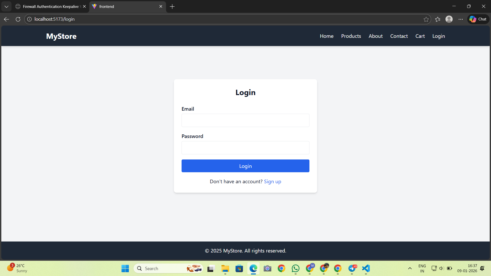
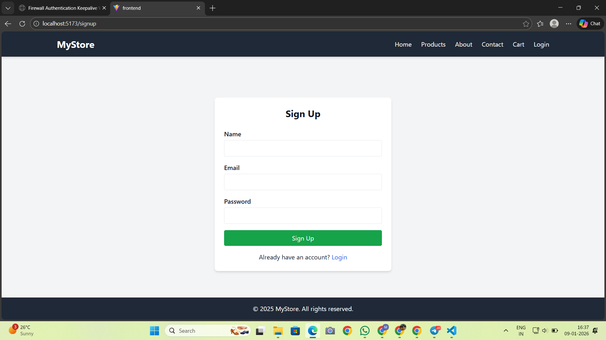
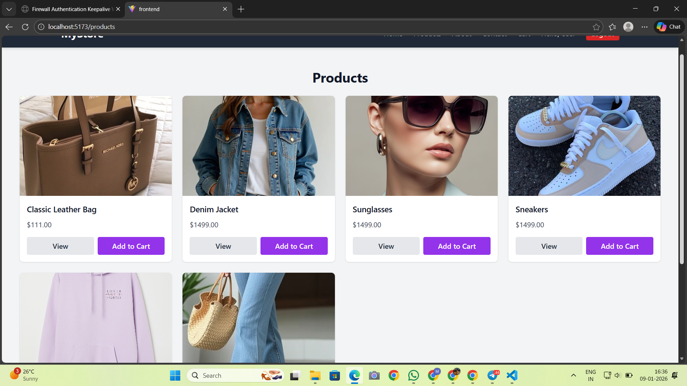

checkout on https://ecommerce-mern-1-8p3a.onrender.com

🛒 MERN E-Commerce Application

A full-stack E-Commerce web application built using the MERN stack (MongoDB, Express, React, Node.js) that supports user authentication, product browsing, cart management, order placement, and secure online payments using Stripe.

🚀 Features

User Registration & Login (JWT Authentication)

Secure Password Hashing

Product Listing & Browsing

Add to Cart & Checkout Flow

Order Creation & Management

Stripe Payment Integration (Payment Intents)

RESTful API Architecture

Environment Variable Management

Error Handling & Validation

🧰 Tech Stack
Frontend

React

JavaScript

HTML5 / CSS3

Backend

Node.js

Express.js

Database

MongoDB - Atlas

Mongoose ODM

Authentication & Security

JSON Web Tokens (JWT)

bcrypt

dotenv

CORS

Payment Gateway

Stripe (Payment Intent API)

📂 Project Structure
ecommerce-mern/
│
├── backend/
│   ├── models/        # Mongoose schemas
│   ├── routes/        # API routes
│   ├── controllers/   # Business logic
│   ├── middleware/    # Auth & utility middleware
│   ├── config/        # DB & Stripe config
│   └── server.js      # Entry point
│
├── frontend/
│   ├── src/
│   │   ├── components/
│   │   ├── pages/
│   │   ├── services/
│   │   └── App.js
│   └── package.json
│
└── README.md

🔐 Authentication Flow

User registers or logs in

Passwords are hashed using bcrypt

On successful login, a JWT token is generated

Token is used to access protected routes

Middleware verifies JWT on each secured request

💳 Payment Flow (Stripe)

Order details are sent to the backend

Backend creates a Stripe Payment Intent

Client receives a client secret

Payment is securely completed on the frontend

Order is marked successful only after confirmation

All payment amounts are calculated and controlled on the backend to prevent tampering.

🗄️ Database Design

Users

Authentication details

User information

Products

Product details

Price & description

Orders

User reference

Product list

Payment status

Order status

⚙️ Installation & Setup
Prerequisites

Node.js

MongoDB

Stripe Account (Test Mode)

Backend Setup
cd backend
npm install
npm start

Frontend Setup
cd frontend
npm install
npm run dev

🔑 Environment Variables

Create a .env file in the backend directory:

MONGO_URI=your_mongodb_connection_string
JWT_SECRET=your_jwt_secret
STRIPE_SECRET_KEY=your_stripe_secret_key

🧪 Testing

Manual testing of authentication, cart, order, and payment flows

Stripe tested using test cards in sandbox mode

📌 Limitations & Future Improvements

Inventory / stock management

Admin dashboard

Order cancellation & refunds UI

Role-based access control

Caching and performance optimization

Deployment with CI/CD

🎯 Learning Outcomes

Full-stack application architecture

Secure authentication using JWT

Stripe payment integration

REST API design

MongoDB schema modeling

Frontend-backend communication

👤 Author

Mansi Behera
Full-Stack / MERN Developer
(Placement-oriented academic project)

📄 License

This project is for learning and demonstration purposes.

## 📸 Screenshots

### 🏠 Home Page

### 🔐 Login Page

### 📝 Signup Page

### 🛍️ Products Page

### 🛒 Add to Cart

### 💳 Payment Page

### ℹ️ About Page

### 📞 Contact Page

